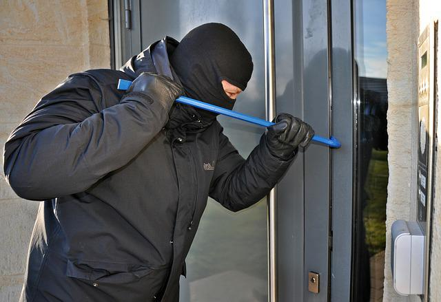
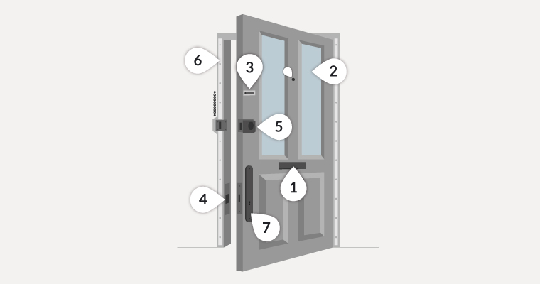

# Remote Door

<strong><u>Situation</u></strong>

In modern work environments, frequent disturbances during meetings can disrupt productivity, particularly when meetings are being held at home remotely.

<strong><u>Task</u></strong>

The task is to design and implement a smart door system that can be easily controlled via a smartphone. This system should allow users to lock and unlock the door remotely and identify who wants to gain access. The goal is to minimize interruptions and enhance productivity during meetings.

<strong><u>Action</u></strong>

Identify the common causes of disturbances during meetings.

Develop a mobile app that can interface with a smart lock.

<strong><u>Result</u></strong>

<li><strong>Weighted scale</strong></li>
<li><strong>Camera</strong></li>
<li><strong>Facial recognition</strong></li>
<li><strong>Passcode</strong></li>
<li><strong>Remote connect from phone to door</strong></li>

